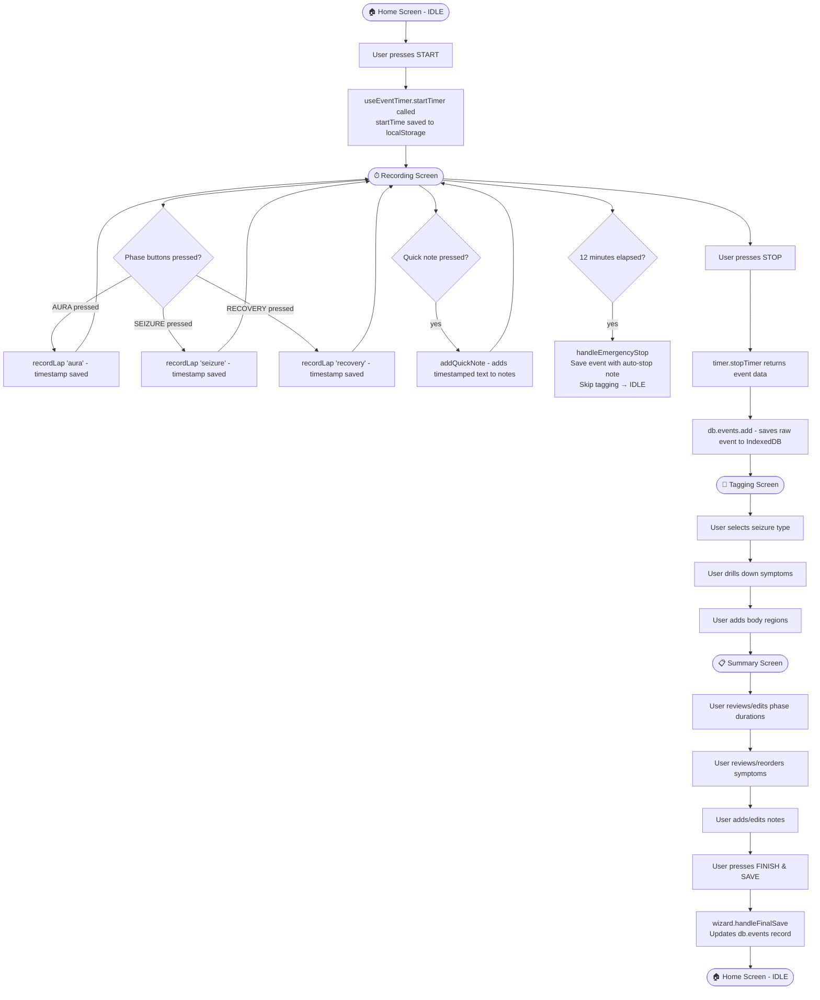
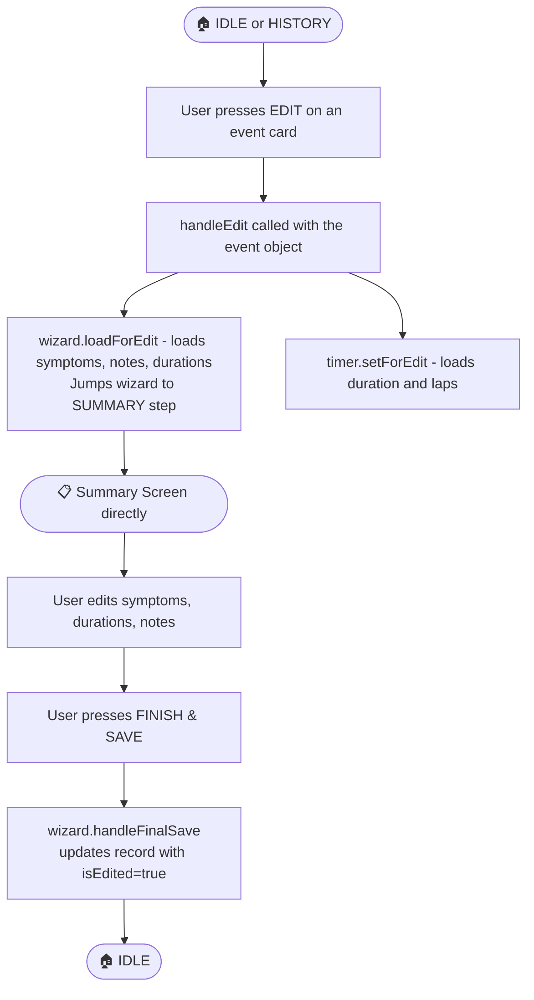
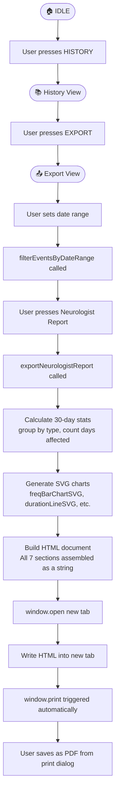
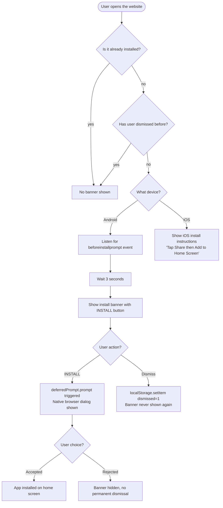
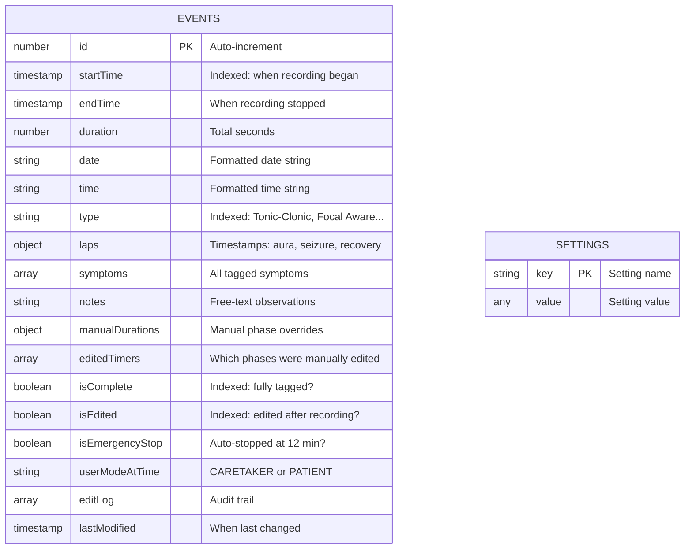

# AuraTrack — A Complete Guide (For a 12-Year-Old)

> This document explains every file, every function, every tool, and every idea used in the AuraTrack project. No experience needed. If there's a word you don't know, scroll to the **Glossary** at the bottom.

---

## Table of Contents

1. [What Is AuraTrack?](#1-what-is-auratrack)
2. [The Tech Stack — Tools Used to Build It](#2-the-tech-stack)
3. [The Project File Tree](#3-the-project-file-tree)
4. [Every File Explained In-Depth](#4-every-file-explained-in-depth)
   - [Entry Points](#entry-points)
   - [Configuration Files](#configuration-files)
   - [Data Layer](#data-layer)
   - [Hooks (Smart State Managers)](#hooks-smart-state-managers)
   - [Pages (The Screens)](#pages-the-screens)
   - [Components (Reusable Building Blocks)](#components-reusable-building-blocks)
   - [Utilities (Helper Functions)](#utilities-helper-functions)
   - [Styles](#styles)
5. [How the App Works — User Journeys](#5-how-the-app-works--user-journeys)
6. [The Database — Where Data Lives](#6-the-database)
7. [The Symptom System — The Medical Brain](#7-the-symptom-system)
8. [Danger Flags — The Safety System](#8-danger-flags--the-safety-system)
9. [Exports and Reports](#9-exports-and-reports)
10. [PWA — Making It Feel Like a Real App](#10-pwa--making-it-feel-like-a-real-app)
11. [Glossary — Definitions for Every Technical Term](#11-glossary)

---

## 1. What Is AuraTrack?

### The Problem It Solves

Imagine you have a family member who has **epilepsy** — a brain condition that causes seizures (sudden bursts of electrical activity in the brain that make the body shake, go stiff, or the person lose consciousness). When a seizure happens, it can be scary and chaotic. You need to:

- Know **how long** the seizure lasted
- Record **what the body did** (did the arm shake? did the eyes roll up?)
- Notice if seizures are happening **more frequently**
- Show a doctor a **clear report** of what has been happening

This is extremely hard to do in the middle of an emergency. Paper notebooks get lost. Memory is unreliable when you are frightened.

**AuraTrack solves this.** It's an app that lives on your phone that lets you:

1. Tap one big button to start recording the moment a seizure begins
2. Mark different phases of the seizure (the warning phase, the main seizure, the recovery)
3. After the seizure, calmly add notes about what happened (what body parts were affected, what symptoms appeared)
4. Review a history of all past seizures
5. Generate a professional medical report that a neurologist (brain doctor) can use

### Who Uses It

The app has two modes:

| Mode | Who is using it | What they see |
|------|-----------------|---------------|
| **CARETAKER** | A parent, nurse, or helper watching the patient | Timer, phase buttons for aura/seizure/recovery, quick-note buttons |
| **PATIENT (Self)** | The patient themselves (if they can feel the seizure coming and have a brief warning called an "aura") | Same tools, but configured for self-recording |

### Key Design Choices

- **100% offline** — No internet needed. All data stays on your phone. This matters for medical privacy.
- **One tap to start** — In an emergency, speed matters. No login, no menu hunting.
- **Works like a phone app** — Even though it's a website, it can be installed on your phone and looks/feels like a native app (this is called a PWA).
- **No server needed** — Nothing is sent anywhere. Your data lives only on your device.

### The Architecture at a Glance

```
┌─────────────────────────────────────────────────┐
│                 YOUR PHONE/BROWSER               │
│                                                 │
│   ┌─────────────────────────────────────────┐   │
│   │           React App (UI)                │   │
│   │  ┌──────────┐  ┌──────────┐            │   │
│   │  │  Pages   │  │  Hooks   │            │   │
│   │  │ (Screens)│  │ (Logic)  │            │   │
│   │  └──────────┘  └────┬─────┘            │   │
│   │                     │                  │   │
│   │               reads/writes             │   │
│   │                     │                  │   │
│   │  ┌──────────────────▼──────────────┐   │   │
│   │  │    Dexie.js (Database Layer)    │   │   │
│   │  └──────────────────┬──────────────┘   │   │
│   │                     │                  │   │
│   │  ┌──────────────────▼──────────────┐   │   │
│   │  │   IndexedDB (Browser Storage)   │   │   │
│   │  │   (Like a notebook built into   │   │   │
│   │  │    every browser)               │   │   │
│   │  └─────────────────────────────────┘   │   │
│   └─────────────────────────────────────────┘   │
│                                                 │
│   ┌─────────────────────────────────────────┐   │
│   │    Service Worker (Offline Manager)     │   │
│   │    (Caches files so the app works       │   │
│   │     even with no internet)              │   │
│   └─────────────────────────────────────────┘   │
└─────────────────────────────────────────────────┘
```

---

## 2. The Tech Stack

The **tech stack** is the collection of tools and libraries used to build the app. Think of them like the ingredients in a recipe.

### The Main Ingredients

| Tool | Version | Plain-English Explanation | Why It Was Chosen |
|------|---------|--------------------------|-------------------|
| **React** | 19.2.5 | The Lego system for building the UI. You make small reusable "pieces" (called components) and snap them together. | Industry standard, huge community, great for apps that change state a lot (like a live timer) |
| **Vite** | 8.0.10 | The packaging machine. Takes all your code files and bundles them into a single super-fast package the browser can read. Also runs a development server with instant updates. | Extremely fast (10–100x faster than older tools), simple setup |
| **Tailwind CSS** | 4.2.4 | A giant collection of pre-written style "stickers". Instead of writing `.button { background: red; padding: 10px; }`, you just write `className="bg-red-500 p-2"` directly in your HTML. | Fast to write, consistent design, no naming collisions |
| **Dexie.js** | 4.4.2 | A friendly wrapper around IndexedDB (the browser's built-in database). Makes storing and reading data easy with simple commands like `db.events.add(...)`. | Makes IndexedDB (which is complex) feel simple; works offline; no server required |
| **Recharts** | 3.8.1 | A library for drawing charts (bar charts, line charts). Built for React. | Easy to use in React, responsive on mobile, flexible |
| **@dnd-kit** | core 6.3.1 | A drag-and-drop library. Used so users can drag symptoms up and down to reorder them. | Modern, accessible, works on touch screens |
| **vite-plugin-pwa** | 1.3.0 | A plugin for Vite that automatically creates a service worker and makes the app installable as a Progressive Web App (PWA). | Automated; handles the complex parts of making an app work offline |
| **ESLint** | 10.2.1 | The code spell-checker. It reads your code and warns you about bugs, bad patterns, or style issues. | Catches mistakes before they cause bugs |
| **PostCSS + Autoprefixer** | 8.5.14 / 10.5.0 | PostCSS transforms CSS. Autoprefixer automatically adds browser-specific prefixes (like `-webkit-`) so CSS works in all browsers. | Ensures styles work in older browsers without manual effort |

### How They Work Together

```
You write JSX code (React + HTML mix)
        │
        ▼
   Vite reads it
        │
        ├── Tailwind CSS processes your class names → optimized CSS
        ├── @vitejs/plugin-react compiles JSX → JavaScript
        ├── vite-plugin-pwa generates a service worker
        │
        ▼
   Output: dist/ folder
   (index.html + bundled JS + bundled CSS + service worker)
        │
        ▼
   Browser loads it
        │
        └── React mounts the app
        └── Dexie connects to IndexedDB
        └── Service Worker enables offline use
```

---

## 3. The Project File Tree

Here is every file in the project, with a one-line explanation:

```
AuraTrack/
│
├── index.html                  ← The one HTML file. The shell that loads everything.
├── package.json                ← The "ingredients list" — lists all tools and libraries used.
├── package-lock.json           ← Auto-generated: exact versions of all packages locked in.
├── vite.config.js              ← Settings for the Vite build tool.
├── postcss.config.js           ← Settings for PostCSS (CSS transformer).
├── eslint.config.js            ← Rules for the code spell-checker (ESLint).
├── Containerfile               ← Recipe for building a Docker container (for running in isolated environment).
├── .gitignore                  ← Tells Git which files to ignore (e.g., node_modules).
├── README.md                   ← Brief project description.
│
├── public/                     ← Files served directly to the browser, unchanged.
│   ├── manifest.json           ← PWA "ID card" — app name, icon, colors for installation.
│   ├── favicon.svg             ← The tiny icon shown in the browser tab.
│   └── icons.svg               ← Additional icon assets.
│
├── src/                        ← All the source code you actually write.
│   ├── main.jsx                ← The very first file that runs. Mounts the React app.
│   ├── App.jsx                 ← The root component. Manages which screen is shown.
│   ├── App.css                 ← Legacy CSS (mostly unused).
│   ├── index.css               ← Global styles, theme variables, touch fixes.
│   ├── constants.js            ← Re-exports constants from data/constants.js.
│   ├── db.js                   ← Re-exports the database from data/db.js.
│   │
│   ├── assets/                 ← Images and icons used in the app.
│   │   ├── hero.png
│   │   ├── react.svg
│   │   └── vite.svg
│   │
│   ├── data/                   ← Data definitions (database + medical constants).
│   │   ├── db.js               ← Creates and configures the Dexie database.
│   │   └── constants.js        ← Seizure types, symptom tree, body region tree.
│   │
│   ├── hooks/                  ← Custom React hooks (smart logic managers).
│   │   ├── useEventTimer.js    ← Manages the live stopwatch during recording.
│   │   ├── useEventHistory.js  ← Loads and deletes events from the database.
│   │   ├── useTaggingWizard.js ← Manages the multi-step symptom form state.
│   │   ├── useSettings.js      ← Loads and saves user preferences.
│   │   └── usePWAInstall.js    ← Handles the "Install App" prompt.
│   │
│   ├── pages/                  ← The 7 main screens of the app.
│   │   ├── IdleView.jsx        ← Home screen: big START button + recent events.
│   │   ├── RecordingView.jsx   ← Live recording screen: timer + phase buttons.
│   │   ├── TaggingView.jsx     ← Post-seizure symptom entry wizard.
│   │   ├── HistoryView.jsx     ← All past events: list, chart, filters.
│   │   ├── SettingsView.jsx    ← Settings screen wrapper.
│   │   ├── ExportView.jsx      ← Export data in various formats.
│   │   └── EventDetailView.jsx ← Full details for a single event.
│   │
│   ├── components/             ← Reusable UI pieces used across screens.
│   │   ├── EventCard.jsx       ← One event shown as a card (date, type, duration).
│   │   ├── WizardMenu.jsx      ← Navigation menu used inside the symptom wizard.
│   │   ├── Summary.jsx         ← The final review screen of the symptom wizard.
│   │   ├── DeleteModal.jsx     ← The "Are you sure?" popup before deleting.
│   │   ├── SeizureTrendChart.jsx ← The zoomable bar/line trend chart.
│   │   ├── SettingsForm.jsx    ← The entire settings form with all inputs.
│   │   ├── ExportCard.jsx      ← A clickable card for each export format.
│   │   └── PWAInstallBanner.jsx ← The "Install this app" banner at the bottom.
│   │
│   └── utils/                  ← Pure helper functions (no React).
│       ├── exportHelpers.js    ← Creates JSON, CSV, PDF, and neurologist reports.
│       ├── dangerFlags.js      ← Detects dangerous seizure patterns.
│       ├── hapticFeedback.js   ← Makes the phone vibrate on button presses.
│       ├── formatters.js       ← Formats numbers into readable text (e.g., "2m 30s").
│       └── pdfCharts.js        ← Generates SVG charts for the neurologist report.
```

---

## 4. Every File Explained In-Depth

---

### Entry Points

---

#### `index.html`

**What it is:** The one and only HTML file in the entire project. Every website needs at least one HTML file — it's the skeleton.

**What it does:**
- Sets the page title to "AuraTrack"
- Links to the PWA manifest (so the browser knows this is an installable app)
- Adds special `<meta>` tags so the app looks like a native iOS app
- Prevents the page from zooming in when you tap an input field
- Prevents the "white flash" you sometimes see when a dark app loads
- Has a `<div id="root">` — this is the empty box where React will inject the entire app
- Loads `src/main.jsx` as the starting JavaScript file

**Key lines explained:**

```html
<!-- This prevents iOS Safari from zooming in when you tap a text field -->
<meta name="viewport" content="..., maximum-scale=1.0, user-scalable=no, viewport-fit=cover">

<!-- This makes iOS treat the web page like a standalone app (hides the browser bar) -->
<meta name="apple-mobile-web-app-capable" content="yes">

<!-- React will render the entire app inside this div -->
<div id="root"></div>

<!-- This loads the JavaScript code that starts everything -->
<script type="module" src="/src/main.jsx"></script>
```

---

#### `src/main.jsx`

**What it is:** The very first JavaScript file that runs. It's the ignition switch.

**What it does:** Uses React's `createRoot` function to "mount" the `App` component inside the `<div id="root">` in `index.html`. This is the moment the React app comes alive.

```jsx
import { StrictMode } from 'react'
import { createRoot } from 'react-dom/client'
import './index.css'  // Load global styles
import App from './App.jsx'

// Find the <div id="root"> and tell React to render <App /> inside it
createRoot(document.getElementById('root')).render(
  <StrictMode>   {/* StrictMode: runs extra checks during development */}
    <App />
  </StrictMode>,
)
```

**`StrictMode`:** A React developer tool that runs each component twice to catch mistakes early. Only active during development, not in the final build.

---

#### `src/App.jsx`

**What it is:** The root (top-level) component. Think of it as the app's "traffic controller" — it decides which screen to show.

**The core concept — Status-Based Routing:**

Most websites use URLs to navigate (e.g., `/history`, `/settings`). AuraTrack instead uses a single piece of state called `status`. This is simpler and works perfectly offline.

```
IDLE ──────────────────────► RECORDING ──────────────────► TAGGING
  │                                                             │
  │◄────────────────────────────────────────────────────────────┘
  │
  ├──► HISTORY ──────────────────► EXPORT
  │       │◄──────────────────────────┘
  │
  ├──► SETTINGS
  │
  └──► EVENT_DETAIL (can be reached from any screen)
```

**Component: `Header`**

```jsx
function Header({ onSettings, onHistory }) { ... }
```

The top bar showing:
- A "HISTORY" button on the left
- The "AURATRACK" title in the center (with a colored line)
- A "⚙ SETTINGS" button on the right

Only visible when NOT recording or tagging (would get in the way).

**Component: `App` (the main one)**

The central controller. Here's what state it manages:

| State variable | Type | What it tracks |
|----------------|------|----------------|
| `status` | string | Which screen is showing: `'IDLE'`, `'RECORDING'`, `'TAGGING'`, `'HISTORY'`, `'SETTINGS'`, `'EXPORT'`, `'EVENT_DETAIL'` |
| `previousStatus` | string | Remembers which screen you were on before going to EVENT_DETAIL, so the Back button works |
| `itemToDelete` | number or null | The ID of an event being deleted (triggers the confirmation popup) |
| `detailEventId` | number or null | The ID of the event whose details are being viewed |
| `fullHistory` | array | All events ever recorded (used to calculate danger flags) |

**Key functions in `App`:**

| Function | What it does |
|----------|-------------|
| `handleStart()` | Resets the wizard, starts the timer, switches to RECORDING screen |
| `handleStop()` | Stops the timer, saves a raw event to the database, switches to TAGGING screen |
| `handleEdit(event)` | Loads an old event into the wizard for editing, switches to TAGGING screen |
| `handleSave()` | Saves the final tagged event, reloads the history, switches back to IDLE |
| `handleCancel()` | Discards tagging, resets everything, goes back to IDLE |
| `handleDeleteConfirm()` | Deletes the event from the database, reloads history, clears the delete prompt |
| `handleEmergencyStop()` | Called when the 12-minute auto-stop triggers. Saves the event with a warning note and skips tagging |
| `goToDetail(id)` | Remembers the current screen, switches to EVENT_DETAIL for a specific event |

**Crash recovery (a clever trick):**

```jsx
useEffect(() => {
  const saved = localStorage.getItem('aura_startTime');
  if (localStorage.getItem('aura_status') === 'RECORDING' && saved) {
    timer.restore(parseInt(saved));  // Restart the timer from the saved start time
    setStatus('RECORDING');
  }
}, []);
```

When the timer starts, it saves the start time to `localStorage` (a small browser storage that survives page refreshes). If the browser closes accidentally during recording, when you reopen the app, it finds this saved start time and continues the recording automatically!

---

### Configuration Files

---

#### `package.json`

**What it is:** The project's "ingredients list". Every JavaScript project has one.

**Key sections:**

```json
{
  "scripts": {
    "dev": "vite",          // Run the development server (with live reload)
    "build": "vite build",  // Build the final production files into dist/
    "lint": "eslint .",     // Run the code spell-checker
    "preview": "vite preview" // Preview the built version locally
  },
  "dependencies": { ... },    // Libraries needed in the final app
  "devDependencies": { ... }  // Libraries only needed during development
}
```

**Dependencies (used in the final app):**

| Package | Version | Purpose |
|---------|---------|---------|
| `react` + `react-dom` | 19.2.5 | The core React library |
| `dexie` | 4.4.2 | Easy IndexedDB access |
| `recharts` | 3.8.1 | Charts |
| `@dnd-kit/core`, `@dnd-kit/sortable`, `@dnd-kit/utilities` | 6.x / 10.x | Drag and drop |
| `tailwindcss` | 4.2.4 | CSS utility classes |
| `@tailwindcss/vite`, `@tailwindcss/postcss` | 4.3.0 | Tailwind integration with Vite and PostCSS |
| `autoprefixer` | 10.5.0 | Adds browser prefixes to CSS |
| `postcss` | 8.5.14 | CSS transformation tool |

**Dev Dependencies (only used while coding):**

| Package | Purpose |
|---------|---------|
| `vite` | The build tool |
| `@vitejs/plugin-react` | Makes Vite understand React's JSX syntax |
| `vite-plugin-pwa` | Makes the app a PWA |
| `eslint` + plugins | Code quality checker |
| `globals` | Provides browser/Node.js global variable definitions for ESLint |
| `@types/react` + `@types/react-dom` | TypeScript type hints (helps editor autocomplete, not required) |

---

#### `vite.config.js`

**What it is:** The configuration file for Vite (the build tool). Tells Vite what plugins to use and how to behave.

```javascript
import { defineConfig } from 'vite'
import react from '@vitejs/plugin-react'
import tailwindcss from '@tailwindcss/vite'
import { VitePWA } from 'vite-plugin-pwa'

export default defineConfig({
  plugins: [
    react(),        // Enable JSX compilation and fast refresh (live updates)
    tailwindcss(),  // Enable Tailwind CSS (processes class names at build time)
    VitePWA({
      registerType: 'autoUpdate', // Service worker auto-updates when new version is deployed
      manifest: false,            // Don't auto-generate manifest.json (we wrote our own)
      workbox: {
        globPatterns: ['**/*.{js,css,html,ico,png,svg}']
        // Cache ALL these file types for offline use
      }
    })
  ],
  server: {
    host: true,  // Makes the dev server accessible from other devices on the same network
  }
})
```

**What `registerType: 'autoUpdate'` means:** When you push an update to the app, the service worker automatically installs the new version in the background. Next time the user opens the app, they get the latest version without having to do anything.

---

#### `postcss.config.js`

**What it is:** Configuration for PostCSS, a tool that transforms CSS.

In modern Tailwind v4, the PostCSS plugin processes your CSS and adds all the utility classes you used. Autoprefixer automatically adds browser vendor prefixes like `-webkit-` to CSS properties that need them for compatibility.

---

#### `eslint.config.js`

**What it is:** Rules for ESLint (the code spell-checker).

The config enables:
- `js.configs.recommended` — Standard JavaScript rules (catches obvious bugs)
- `eslint-plugin-react-hooks` — Warns if you use React hooks incorrectly (hooks have strict rules)
- `eslint-plugin-react-refresh` — Warns about components that might break Vite's live refresh

---

#### `public/manifest.json`

**What it is:** The PWA "ID card". When the browser sees this file linked from `index.html`, it knows the website can be installed as a real app.

```json
{
  "short_name": "AuraTrack",              // Name shown under the icon on your home screen
  "name": "AuraTrack: Epilepsy Monitor",  // Full name
  "start_url": "/",                        // Opens the home page when launched
  "display": "standalone",                 // Hides the browser bar — looks like a real app
  "theme_color": "#0f172a",               // Dark navy — the color of the phone's status bar
  "background_color": "#0f172a",           // Dark navy — color shown while app is loading
  "icons": [...]                           // The app icon (used on home screen, task switcher)
}
```

---

#### `Containerfile`

**What it is:** A recipe for building a **Docker/Podman container** — an isolated environment that runs the app in a box.

This is used for development so the app can run on any computer without worrying about what software is installed. The file says:
1. Start with a Node.js 20 slim base image
2. Copy the code in
3. Run `npm ci` to install packages (faster and stricter than `npm install`)
4. Run `npm run dev` to start the development server
5. Expose port 5173 (where Vite's dev server runs)

---

### Data Layer

---

#### `src/data/db.js`

**What it is:** The database setup file. Creates the database and defines its structure (called a **schema**).

```javascript
import Dexie from 'dexie';

// Create a new database named 'AuraTrackDB'
export const db = new Dexie('AuraTrackDB');

// Version 3: Just the events table
db.version(3).stores({
  events: '++id, startTime, date, type, isComplete, isEdited, notes'
  //  ++id = auto-increment primary key (1, 2, 3, ...)
  //  The rest = fields you can search/filter by (called indexes)
});

// Version 4: Added the settings table
db.version(4).stores({
  events: '++id, startTime, date, type, isComplete, isEdited, notes',
  settings: 'key'  // settings are stored as key-value pairs
});
```

**Why versions?** When you update an app, sometimes the database structure changes (you add a new field, a new table, etc.). Dexie handles this automatically using versions — when users upgrade the app, Dexie migrates their existing data to the new structure.

**What goes in each row of the `events` table:**

| Field | Type | Example | What it means |
|-------|------|---------|---------------|
| `id` | number | `42` | Auto-generated ID, like a row number |
| `startTime` | timestamp | `1716019200000` | When recording started (milliseconds since 1970) |
| `endTime` | timestamp | `1716019560000` | When recording stopped |
| `duration` | number | `360` | Total seconds |
| `date` | string | `"18/05/2026"` | Human-readable date |
| `time` | string | `"14:30:00"` | Human-readable time |
| `type` | string | `"Tonic-Clonic"` | Seizure type chosen during tagging |
| `laps` | object | `{ aura: 12345, seizure: 23456, recovery: 34567 }` | Timestamps when each phase button was tapped |
| `symptoms` | array | `[{ symptom: "Big Shaking", detail: "Rhythmic Shaking", ... }]` | All symptoms added during tagging |
| `notes` | string | `"Patient fell. Rescue med given."` | Free-text observations |
| `manualDurations` | object | `{ aura: 30, seizure: 90, recovery: 60, total: 180 }` | Phase durations if manually edited |
| `editedTimers` | array | `["seizure", "total"]` | Which phases were manually changed |
| `isComplete` | boolean | `true` | Has this event been fully tagged? |
| `isEdited` | boolean | `false` | Was this event edited after the fact? |
| `isEmergencyStop` | boolean | `false` | Did the 12-minute auto-stop trigger? |
| `userModeAtTime` | string | `"CARETAKER"` | Who was recording |
| `editLog` | array | `[]` | Audit trail (reserved for future use) |
| `lastModified` | timestamp | `1716019700000` | When this event was last changed |

---

#### `src/data/constants.js`

**What it is:** A big file of medical data. Defines three things:

1. **`SYMPTOM_WIZARD`** — The 4-level symptom tree
2. **`REGION_WIZARD`** — The body region tree
3. **`SEIZURE_TYPES`** — The list of seizure type names

##### SYMPTOM_WIZARD — The 4-Level Tree

The app guides users through selecting symptoms using a drill-down approach:

```
Level 1: Category
    └── Level 2: Symptom Group
            └── Level 3: Specific Symptom (with medical term)
                    └── Level 4: Body Region (from REGION_WIZARD)
```

The structure in code:

```javascript
export const SYMPTOM_WIZARD = {
  "Physical Movement": {          // Category (Level 1)
    "Big Shaking/Jerking": {      // Symptom Group (Level 2)
      skipRegion: false,          // Should we ask about body region?
      options: [
        {
          label: "Rhythmic Shaking",  // What the user sees (Level 3)
          med: "Clonic activity"       // Medical term (shown in reports)
        },
        {
          label: "Body gone rigid",
          med: "Tonic posturing",
          forceRegion: "Whole Body",    // Skip the region picker — always "Whole Body"
          forceSubRegion: "General"
        }
      ]
    }
  }
}
```

**`skipRegion: true`** — Some symptoms don't need a body region. For example, "Rising butterfly feeling in stomach" always refers to the stomach. No need to ask "which part of the body?"

**`forceRegion`** — Some symptoms always happen in one place. For example, "Jaw Clenched" always means the mouth. The app auto-fills the region and skips that step.

**The 5 Categories:**

| Category | Example Symptoms |
|----------|-----------------|
| Physical Movement | Small Twitching, Big Shaking, Stiffening, Losing Control, Automatic Habits |
| Sensory & Vision | Skin Tingling, Flashing Lights, Strange Smell/Taste |
| Internal & Autonomic | Racing Heart, Nausea, Sudden Sweating |
| Head & Face | Drooling, Eyes Rolling Up, Tongue Biting |
| Mental & Speech | Confused/Dream-like, Unable to Speak, Sudden Fear |

##### REGION_WIZARD — The Body Region Tree

```javascript
export const REGION_WIZARD = {
  "Whole Body": {
    "General": ["Both Sides Equally", "Starts one side -> Spreads", "Alternating Sides"]
  },
  "Head & Face": {
    "Eyes": ["Left Eye", "Right Eye", "Both Eyes"],
    "Mouth": ["Left Side", "Right Side", "Full Mouth", "Tongue"],
    // ...
  },
  "Arms": {
    "Left Arm": ["Whole Arm", "Shoulder", "Upper Arm", "Elbow", "Wrist", "Hand/Fingers"],
    "Right Arm": ["Whole Arm", "Shoulder", "Upper Arm", "Elbow", "Wrist", "Hand/Fingers"]
  },
  // Legs, Torso...
}
```

##### SEIZURE_TYPES

```javascript
export const SEIZURE_TYPES = [
  'Tonic-Clonic',   // Full-body shaking, loss of consciousness
  'Focal Aware',    // In one part of brain, person stays conscious
  'Focal Impaired', // In one part of brain, person is confused
  'Absence',        // Brief staring, unresponsive for seconds
  'Aura Only'       // The warning phase but no full seizure followed
];
```

---

### Hooks (Smart State Managers)

> **What is a Hook?** In React, a hook is a special function (always named `useXxx`) that lets a component remember things (state) and react to changes (effects). Think of a hook as a mini-brain that keeps track of one specific concern.

---

#### `src/hooks/useEventTimer.js`

**Purpose:** Manages everything about the live recording timer — starting it, stopping it, marking phases, and recovering from crashes.

**How a stopwatch works in code:**

```javascript
// Every second, calculate elapsed = (now - startTime) / 1000
useEffect(() => {
  let interval;
  if (isRunning && startTime) {
    interval = setInterval(() => {
      setElapsed(Math.floor((Date.now() - startTime) / 1000));
    }, 1000);  // Run every 1000 milliseconds = 1 second
  }
  return () => clearInterval(interval); // Cleanup when timer stops
}, [isRunning, startTime]);
```

**Functions it provides:**

| Function | What it does |
|----------|-------------|
| `startTimer()` | Records start time, begins counting, saves to localStorage (crash safety) |
| `stopTimer()` | Stops counting, calculates total duration, clears localStorage, returns event data |
| `recordLap(phase)` | Records the current timestamp for a phase (`'aura'`, `'seizure'`, or `'recovery'`). Triggers a 100ms phone vibration. |
| `restore(savedStartTime)` | Restarts the timer from a saved start time (for crash recovery) |
| `setForEdit(duration, laps, startTime)` | Loads an existing event's timer data (for editing old events) |

**State it manages:**

| State | Initial value | What it tracks |
|-------|---------------|----------------|
| `isRunning` | `false` | Is the timer currently ticking? |
| `startTime` | `null` | The Unix timestamp when START was pressed |
| `elapsed` | `0` | How many seconds have passed |
| `laps` | `{ aura: null, seizure: null, recovery: null }` | Timestamps when each phase button was pressed |

---

#### `src/hooks/useEventHistory.js`

**Purpose:** Handles loading events from the database and deleting them. Simple data access layer.

```javascript
export function useEventHistory() {
  const [history, setHistory] = useState([]);  // The 5 most recent events

  // Load the 5 most recent events (for the home screen)
  const load = async () => {
    const events = await db.events
      .orderBy('startTime')  // Sort by start time
      .reverse()             // Newest first
      .limit(5)             // Only 5
      .toArray();
    setHistory(events);
  };

  // Load ALL events (for danger flag calculation and full history view)
  const loadAll = async () => {
    return await db.events.orderBy('startTime').reverse().toArray();
  };

  // Delete one event by its ID
  const deleteEvent = async (id) => {
    await db.events.delete(id);
  };

  return { history, load, loadAll, deleteEvent };
}
```

---

#### `src/hooks/useTaggingWizard.js`

**Purpose:** The most complex hook. Manages the entire multi-step symptom selection process — which step you're on, what you've selected, the list of symptoms, the notes, and the save operation.

**State it manages:**

| State | Initial value | What it tracks |
|-------|---------------|----------------|
| `taggingStep` | `'TYPE'` | Which wizard step you're on (`'TYPE'`, `'S_CAT'`, `'S_SYM'`, `'S_DET'`, `'R_CAT'`, `'R_SUB'`, `'R_DET'`, `'SUMMARY'`) |
| `selections` | `{ type:'', group:'', symptom:'', ... }` | The current drill-down selection path |
| `tempSymptomList` | `[]` | The list of symptoms added so far |
| `notes` | `''` | The free-text clinical notes |
| `editingId` | `null` | ID of the event being edited (if in edit mode) |
| `activeEventId` | `null` | ID of the just-recorded event being tagged |
| `manualDurations` | `{}` | Manual phase duration overrides |
| `editedTimers` | `[]` | Which phases were manually edited |

**Key functions:**

| Function | What it does |
|----------|-------------|
| `setActiveEvent(id)` | Sets which database event we're tagging |
| `loadForEdit(event)` | Loads an existing event's data so the user can edit it. Jumps straight to the SUMMARY step. |
| `setManualDuration(phase, seconds)` | Records a manually-entered duration for a phase |
| `handleFinalSave()` | Writes everything to the database. Uses `editingId` OR `activeEventId` as the target. |
| `reset()` | Clears all wizard state back to defaults |
| `moveSymptom(index, direction)` | Swaps a symptom up or down in the list. Triggers a 40ms vibration. |
| `addQuickNote(label, elapsed)` | Adds a timestamped note like `[T+45s] FELL` to the notes field. Triggers a 50ms vibration. |

**How `handleFinalSave` works:**

```javascript
const handleFinalSave = async () => {
  const targetId = editingId || activeEventId;  // Which event to update?

  // If editing an old event that already had a type, keep it
  let type = selections.type;
  if (!type && editingId) {
    const existing = await db.events.get(editingId);
    type = existing?.type || 'Uncategorized';
  }

  // Update the database record
  await db.events.update(targetId, {
    type: type || 'Uncategorized',
    symptoms: [...tempSymptomList],
    notes,
    isComplete: true,
    isEdited: !!editingId,  // true if this was an edit, false if new
    lastModified: Date.now(),
    manualDurations,
    editedTimers,
    // If the user manually set a total duration, sync it to event.duration too
    ...(manualDurations?.total != null ? { duration: manualDurations.total } : {}),
  });

  reset(); // Clear everything
};
```

---

#### `src/hooks/useSettings.js`

**Purpose:** Loads all user preferences from the database when the app opens, and saves them back whenever they change.

**Default Settings:**

```javascript
const DEFAULTS = {
  userMode: 'CARETAKER',       // Who is recording: 'CARETAKER' or 'PATIENT'
  personName: '',              // Patient's name (for reports)
  caretakerName: '',           // Caretaker's name (for reports)
  dateOfBirth: '',
  emergencyContact: '',
  neurologistName: '',         // Doctor's name (for reports)
  neurologistInstitution: '',
  neurologistContact: '',
  includePatientDOB: true,
  reportNotes: '',             // Custom notes for the neurologist report
  theme: 'dark',               // 'dark' | 'light' | 'system'
  accentColor: 'red',          // 'red' | 'blue' | 'green' | 'purple' | 'amber'
  fontSize: 'normal',          // 'small' | 'normal' | 'large' | 'xlarge'
  historyPageSize: 10,         // How many events per page in history
  dateFormat: 'locale',        // How to format dates
  durationFormat: 'seconds',   // 'seconds' (e.g. "90s") or 'human' (e.g. "1m 30s")
  timeFormat: '12h',           // '12h' or '24h'
  hapticFeedback: true,        // Should the phone vibrate on button presses?
  quickNoteLabels: ['FELL', 'RESCUE MED', 'NOT RESPONDING', 'FULL BODY', 'LEFT SIDE', 'RIGHT SIDE'],
  autoBackupFrequency: 'never', // 'never' | 'weekly' | 'monthly'
};
```

**How it works:**

```javascript
// On startup: load all settings from database and merge with defaults
useEffect(() => {
  const loadSettings = async () => {
    const rows = await db.settings.toArray();  // [{key:'theme', value:'light'}, ...]
    const merged = { ...DEFAULTS };            // Start with defaults
    rows.forEach(row => { merged[row.key] = row.value; }); // Override with saved values
    setSettings(merged);
  };
  loadSettings();
}, []);

// When a setting changes: save it to database AND update state immediately
const updateSettings = async (key, value) => {
  await db.settings.put({ key, value });  // Save to IndexedDB
  setSettings(prev => ({ ...prev, [key]: value }));  // Update in memory
};
```

---

#### `src/hooks/usePWAInstall.js`

**Purpose:** Manages the "Install this app" prompt. Different behavior on iOS vs Android because of how each OS handles PWA installation.

**The problem:** iOS and Android handle PWA installation differently:
- **Android/Chrome:** Shows a built-in prompt automatically. The browser fires a special event (`beforeinstallprompt`) that you can intercept and show at the right time.
- **iOS/Safari:** Has no automatic prompt. Users must manually tap Share → "Add to Home Screen". The app can only show instructions.

```javascript
// Detect if already installed (running in standalone mode)
const isInstalled = () => window.matchMedia('(display-mode: standalone)').matches;

// Detect iOS
const isIOSDevice = () => /iPad|iPhone|iPod/.test(navigator.userAgent);

export function usePWAInstall() {
  const [deferredPrompt, setDeferredPrompt] = useState(null); // Android's install event
  const [isVisible, setIsVisible] = useState(false);          // Show the banner?

  useEffect(() => {
    if (isInstalled()) return;  // Already installed — don't show banner
    if (localStorage.getItem(DISMISSED_KEY)) return;  // User dismissed — don't show again

    if (ios) {
      // On iOS, just show instructions after 3 seconds
      const t = setTimeout(() => setIsVisible(true), 3000);
      return () => clearTimeout(t);
    }

    // On Android: listen for the browser's install event
    const handler = (e) => {
      e.preventDefault();           // Stop the automatic prompt
      setDeferredPrompt(e);         // Save the event for later
      setTimeout(() => setIsVisible(true), 3000); // Show our custom banner after 3s
    };

    window.addEventListener('beforeinstallprompt', handler);
    return () => window.removeEventListener('beforeinstallprompt', handler);
  }, []);

  // Trigger the install on Android
  const install = async () => {
    if (!deferredPrompt) return;
    deferredPrompt.prompt();  // Show the browser's native install dialog
    const { outcome } = await deferredPrompt.userChoice;
    if (outcome === 'accepted') {
      setDeferredPrompt(null);
      setIsVisible(false);
    }
  };

  // User said "not now" — remember their choice
  const dismiss = () => {
    localStorage.setItem(DISMISSED_KEY, '1');
    setIsVisible(false);
  };
}
```

---

### Pages (The Screens)

---

#### `src/pages/IdleView.jsx`

**Purpose:** The home screen. The first thing you see when you open the app.

**What it shows:**
- A large circular START button (240×240px) with a red glow effect
- The phrase "START SEIZURE LOG" (caretaker) or "LOG MY SEIZURE" (patient)
- Up to 5 recent events, shown as EventCards
- Danger badges on events that need attention (⚠ >5 MIN, 🔴 CLUSTER)
- An "empty state" message if no events have been recorded yet

**How the danger map works:**

```jsx
// Build a map of {eventId: ['long_duration', 'cluster']} for all events
// This is done once, efficiently, using useMemo (only recalculates when data changes)
const dangerMap = useMemo(() => buildDangerMap(fullHistory), [fullHistory]);
```

Then each EventCard is passed its danger flags:
```jsx
<EventCard event={event} dangerFlags={dangerMap[event.id] || []} ... />
```

---

#### `src/pages/RecordingView.jsx`

**Purpose:** The live recording screen. The most time-critical screen in the app — it must be clear, fast, and work correctly under stress.

**What it shows:**

```
┌────────────────────────────────┐
│         00:02:34               │  ← Big timer (turns red at 4+ minutes)
│                                │
│  ┌──────────┐ ┌─────────────┐  │
│  │   AURA   │ │  FELL       │  │
│  │  SEIZURE │ │  RESCUE MED │  │  ← Phase buttons (left) + Quick notes (right)
│  │ RECOVERY │ │  NOT RESPON │  │
│  └──────────┘ └─────────────┘  │
│                                │
│    ████████████████████████    │  ← BIG RED STOP BUTTON
└────────────────────────────────┘
```

**Phase buttons (Caretaker mode only):**

| Button | What it records |
|--------|----------------|
| AURA | The warning phase (tingling, strange feelings) |
| SEIZURE | The main event (shaking, stiffening) |
| RECOVERY | Coming back to consciousness |

Pressing a phase button calls `timer.recordLap('aura')` etc., which stamps the exact timestamp.

**The 5-minute alert:**

```jsx
// When the seizure has gone on too long, show a full-screen red overlay
const showRedAlert = seizureElapsed > 300; // 300 seconds = 5 minutes

// Different thresholds for caretaker vs patient
// Caretaker: watches the 'seizure' phase timer
// Patient: watches the total elapsed time
```

When this triggers, a red pulsing overlay covers the entire screen with instructions like "CALL 999 IF UNRESPONSIVE". The user can dismiss it (it won't re-trigger for this recording session).

**The 12-minute auto-stop:**

```jsx
useEffect(() => {
  if (elapsed >= 720) {  // 720 seconds = 12 minutes
    onEmergencyStop();   // Automatically save and go to IDLE
  }
}, [elapsed]);
```

If 12 minutes pass, the recording stops automatically. This handles the worst case where the caretaker can no longer interact with the phone. The event is saved with a note: "PATIENT UNRESPONSIVE — all timers automatically stopped at 12 minutes."

**Quick note buttons:**

These let the caretaker stamp the current time with a label during recording. For example, pressing "FELL" at 45 seconds adds `[T+45s] FELL` to the notes field. This is done through `wizard.addQuickNote(label, elapsed)`.

---

#### `src/pages/TaggingView.jsx`

**Purpose:** The multi-step symptom wizard. Runs after a seizure is over.

**The wizard steps:**

```
TYPE       → Select the seizure type (Tonic-Clonic, Focal Aware, etc.)
    │
    ▼
S_CAT      → Select the symptom category (Physical Movement, Sensory, etc.)
    │
    ▼
S_SYM      → Select the symptom group (Big Shaking, Stiffening, etc.)
    │
    ▼
S_DET      → Select the specific symptom (Rhythmic Shaking, Violent Jolts, etc.)
    │
    ├── skipRegion=true → Add to list, back to S_CAT
    ├── forceRegion → Skip to R_DET with preset region
    │
    ▼
R_CAT      → Select the body region (Whole Body, Arms, Legs, etc.)
    │
    ▼
R_SUB      → Select the sub-region (Left Arm, Right Leg, etc.)
    │
    ▼
R_DET      → Select the specific part (Shoulder, Knee, etc.)
    │
    ▼
SUMMARY    → Review symptoms, edit durations, add notes, SAVE
```

Each step uses the `WizardMenu` component (a scrollable list of buttons). Pressing "back" always returns to the previous step.

When a symptom is fully selected, it's added to `tempSymptomList` and the wizard resets to `S_CAT` so another symptom can be added.

The `SUMMARY` step renders the `Summary` component.

---

#### `src/pages/HistoryView.jsx`

**Purpose:** Shows all recorded events with a trend chart, filters, and pagination.

**Key features:**

- **Trend chart** at the top (`SeizureTrendChart`) — shows frequency over time
- **Type filter** — dropdown to show only one seizure type
- **Date filter** — date input to narrow by date
- **Pagination** — configurable number of events per page (from settings)
- **Event cards** — each with danger badges, edit/delete/view buttons

**Pagination logic:**

```
Total events: 23  |  Page size: 10
Page 1: events 1-10
Page 2: events 11-20
Page 3: events 21-23
```

Buttons: [← PREV] [1] [2] [3] [NEXT →]

---

#### `src/pages/SettingsView.jsx`

**Purpose:** A thin wrapper around the `SettingsForm` component. Just adds a scrollable container and a back button.

---

#### `src/pages/ExportView.jsx`

**Purpose:** Lets users export their data in different formats.

**Features:**
- Date range pickers (from/to)
- Filter events by selected range
- Shows count of events in range
- Export cards for JSON, CSV, PDF, and Neurologist Report

---

#### `src/pages/EventDetailView.jsx`

**Purpose:** Shows full details for a single event.

**What it shows:**
- Danger alerts at the top (if this event triggered danger flags)
- Duration breakdown: Total, Aura, Seizure, Recovery
- Date, time, recorded-by, edit history
- All symptoms with their medical terms and locations
- Clinical observations (notes)
- An EDIT button

**Danger flag display:**

```jsx
const flags = computeDangerFlags(event, allEvents);

{flags.includes('long_duration') && (
  <AlertCard
    title="Long Duration Event"
    message="This event lasted over 5 minutes. This may require medical attention."
    color="amber"
  />
)}

{flags.includes('cluster') && (
  <AlertCard
    title="Cluster Seizure Risk"
    message="3 or more events occurred within 8 minutes without confirmed recovery."
    color="red"
  />
)}
```

---

### Components (Reusable Building Blocks)

---

#### `src/components/EventCard.jsx`

**Purpose:** Displays a single event as a compact card. Used in IdleView and HistoryView.

**What it shows:**

```
┌───────────────────────────────────────────┐
│ ⚠ >5 MIN   🔴 CLUSTER     18/05/2026     │
│ Tonic-Clonic          14:30:00   2m 30s  │
│                       [👁 VIEW] [✎ EDIT] [🗑] │
└───────────────────────────────────────────┘
```

**Danger badges:**
- `long_duration` flag → amber badge ">5 MIN"
- `cluster` flag → red badge "CLUSTER/SE RISK" (SE = Status Epilepticus, a medical emergency)

**Props it receives:**

| Prop | What it is |
|------|-----------|
| `event` | The full event object |
| `dangerFlags` | Array of flag strings for this event |
| `onEdit` | Function called when EDIT is clicked |
| `onDelete` | Function called when DELETE is clicked |
| `onViewDetail` | Function called when VIEW is clicked |

---

#### `src/components/WizardMenu.jsx`

**Purpose:** A reusable menu component for the symptom wizard. Shows a title, a back button, and a scrollable list of option buttons.

**Structure:**

```
[← BACK]  [    TITLE    ]  [empty]
─────────────────────────────────
[ Option 1                       ]
[ Option 2                       ]
[ Option 3                       ]
[ Option 4                       ]
```

Each option button calls `onSelect(option)` when pressed. The whole component fades in with a CSS animation when it appears.

---

#### `src/components/Summary.jsx`

**Purpose:** The final step of the tagging wizard. A complex component with three sub-components inside it.

**What it shows:**

```
[Aura: 30s  EDIT] [Seizure: 90s  EDIT] [Recovery: 60s  EDIT] [Total: 3m 0s  EDIT]

─── SYMPTOMS ────────────────────────────────────────────
  ▲▼  Big Shaking › Rhythmic Shaking  @  Whole Body     [✕]
  ▲▼  Eyes rolling up  @  Head & Face › Eyes             [✕]
  [ + ADD ANOTHER SYMPTOM ]

─── NOTES ───────────────────────────────────────────────
  Patient fell at 45s. Rescue med given at 2m.

[      FINISH & SAVE LOG      ]     [Cancel & Discard]
```

**Sub-components inside Summary.jsx:**

##### `EditableTimer`

A 3-stage inline editor for phase durations:

```
Stage 1 — Display:       "Seizure: 1m 30s"  [EDIT]
                                               ↓ press EDIT
Stage 2 — Confirm:       "Edit Seizure?"  [YES]  [NO]
                                               ↓ press YES
Stage 3 — Input:         [____90____] seconds  [✓ SAVE]  [✗]
```

When the user saves a manual duration, it calls `setManualDuration(phase, seconds)` and the display updates to show the new value with an "edited" indicator.

##### `SortableSymptomRow`

Each symptom row in the list. Has:
- A drag handle (▲▼ pair) on the left
- The symptom name and location
- An ✕ delete button on the right

Uses `@dnd-kit/sortable`'s `useSortable` hook to enable dragging.

##### `DragHandle`

The visual ▲▼ indicator. Has `touchAction: 'none'` to prevent the page from scrolling when dragging on mobile.

**How drag-and-drop works:**

```jsx
// Wrap everything in a DndContext
<DndContext sensors={sensors} onDragEnd={handleDragEnd}>
  <SortableContext items={idList} strategy={verticalListSortingStrategy}>
    {tempSymptomList.map((s, i) => (
      <SortableSymptomRow key={s._id} symptom={s} index={i} />
    ))}
  </SortableContext>
</DndContext>

// When drag ends, swap the symptom positions
const handleDragEnd = (event) => {
  const { active, over } = event;
  if (active.id !== over?.id) {
    const oldIndex = idList.indexOf(active.id);
    const newIndex = idList.indexOf(over.id);
    setTempSymptomList(arrayMove(tempSymptomList, oldIndex, newIndex));
  }
};
```

---

#### `src/components/DeleteModal.jsx`

**Purpose:** A confirmation popup that appears before deleting an event.

```
┌─────────────────────────────────┐
│         🗑 Delete Event         │
│                                 │
│  Are you sure? This cannot      │
│  be undone.                     │
│                                 │
│   [  YES, DELETE  ]  [  CANCEL  ] │
└─────────────────────────────────┘
```

The background has a `backdrop-blur` effect. Pressing "Yes, Delete" calls `onConfirm()`, pressing Cancel calls `onCancel()`.

---

#### `src/components/SeizureTrendChart.jsx`

**Purpose:** A zoomable chart showing seizure frequency and duration over time.

**12 zoom levels:**

```
1D | 3D | 7D | 14D | 30D | 60D | 90D | 6M | 1Y | 18M | 2Y
                        ↑
                   current zoom (shown as a dot indicator)
```

**Time bucketing logic:**

| Zoom window | How data is grouped |
|------------|---------------------|
| 1 day | By hour (24 bars) |
| ≤ 90 days | By day |
| > 90 days | By week |

**Chart types:**
- **Bar chart** — shows count of events in each time bucket
- **Line chart** — shows duration of each event over time

Uses Recharts `<BarChart>` or `<LineChart>` depending on the toggle.

**Custom tooltip** — when you hover over a bar/point, it shows:
```
18 May 2026
Events: 2
Total duration: 4m 15s
```

---

#### `src/components/SettingsForm.jsx`

**Purpose:** The entire settings UI. Organized into labeled sections.

**Sections:**

1. **Identity** — User mode toggle (CARETAKER / SELF), patient name, caretaker name, date of birth, emergency contact
2. **Appearance** — Theme (dark/light/system), accent color (5 color chips), font size (4 sizes)
3. **Display** — History page size, date format, time format, duration format
4. **Recording** — Haptic feedback toggle, 6 customizable quick-note label inputs
5. **Data & Backup** — Storage info, export all data, import data, DANGER ZONE (clear all data, reset settings)
6. **Reports** — Neurologist name, institution, contact, notes for report
7. **About** — App version, re-show install prompt, reset to defaults

**Internal sub-components (inside SettingsForm.jsx):**

| Sub-component | What it renders |
|---------------|----------------|
| `Section` | A labeled group with a top heading and bottom divider |
| `Row` | A horizontal row with a label on the left and control on the right |
| `FieldLabel` | The label text for a row |
| `TextField` | A text input field |
| `Segments` | A group of pill-shaped toggle buttons (for multi-choice settings like theme or accent) |
| `Toggle` | A single on/off switch (for haptic feedback, include DOB, etc.) |
| `ActionBtn` | A styled button for actions like "Export All", "Import", "Reset" |

---

#### `src/components/ExportCard.jsx`

**Purpose:** A simple clickable card for each export format.

```
┌────────────────────────────────┐
│  📄 JSON Backup                │
│  Full data export for backup   │
└────────────────────────────────┘
```

Pressing it calls the corresponding export function.

---

#### `src/components/PWAInstallBanner.jsx`

**Purpose:** The "Install this app" banner that slides in from the bottom.

**Android:**
```
┌───────────────────────────────────────┐
│  📱  Install AuraTrack for offline    │
│       access                [INSTALL] │  ← Triggers native browser install
└───────────────────────────────────────┘
```

**iOS:**
```
┌───────────────────────────────────────┐
│  📱  To install: tap [⬆] Share then  │
│       "Add to Home Screen"      [✕]   │
└───────────────────────────────────────┘
```

The banner animates in from the bottom (`slide-in-from-bottom-6`). It only shows if:
- The app is NOT already installed
- The user hasn't dismissed it before (checked via `localStorage`)
- On Android: the `beforeinstallprompt` event fired
- After a 3-second delay (to not interrupt the user right away)

---

### Utilities (Helper Functions)

---

#### `src/utils/exportHelpers.js`

**Purpose:** Contains all the functions that generate and download data files.

**`filterEventsByDateRange(events, fromDateStr, toDateStr)`**

Filters an array of events to only include those within a date range.

```javascript
// Set the from date to the start of the day (00:00:00)
const from = fromDateStr ? new Date(fromDateStr).setHours(0, 0, 0, 0) : 0;
// Set the to date to the end of the day (23:59:59)
const to = toDateStr ? new Date(toDateStr).setHours(23, 59, 59, 999) : Date.now();
return events.filter(e => e.startTime >= from && e.startTime <= to);
```

**`exportToJSON(events)`**

Downloads all events as a `.json` file. JSON is a text format that looks like JavaScript objects. Good for full backups.

```javascript
const blob = new Blob(
  [JSON.stringify(events, null, 2)],  // Pretty-print with 2-space indent
  { type: 'application/json' }
);
triggerDownload(blob, `auratrack-backup-2026-05-18.json`);
```

**`exportToCSV(events)`**

Downloads events as a `.csv` file (Comma-Separated Values). Can be opened in Excel.

```
id,date,time,type,duration,notes
1,18/05/2026,14:30:00,Tonic-Clonic,360,"Patient fell at 45s"
2,17/05/2026,09:15:00,Absence,12,""
```

Uses `formatCSVRow(event)` from `formatters.js` to build each row.

**`exportToPDF(events)`**

Opens a new browser tab with a simple HTML table, then automatically triggers the browser's Print dialog. The user can save as PDF from there.

**`exportNeurologistReport(events, settings)`**

The most complex function in the project. Generates a full clinical neurologist report as an HTML document, then opens it in a new tab and triggers printing.

The report contains 7 sections:
1. **Header** — Patient name, reporter, neurologist, period
2. **Recent Events Table** — Last 10 events with phase durations
3. **Medication & Context** — Awareness levels, rescue medication use
4. **Trend Analysis** — 4 SVG charts
5. **Condensed Event Details** — Full breakdown of important events
6. **Ictal Symptom Log** — All symptoms with medical terms
7. **Clinical Flags** — Automatic warnings about concerning patterns
8. **Data Quality** — How reliable the data is (HIGH/MEDIUM/LOW confidence score)

**`triggerDownload(blob, filename)` (private helper)**

Creates an invisible `<a>` tag, sets its `href` to a temporary URL, clicks it programmatically, then removes it. This triggers a file download.

```javascript
function triggerDownload(blob, filename) {
  const url = URL.createObjectURL(blob);  // Create temporary URL for the data
  const a = document.createElement('a');  // Create invisible link
  a.href = url;
  a.download = filename;
  a.click();                               // Simulate a click to trigger download
  URL.revokeObjectURL(url);                // Clean up the temporary URL
}
```

**`dateStamp()` (private helper)**

Returns today's date as `"2026-05-18"` (ISO format) for use in filenames.

---

#### `src/utils/dangerFlags.js`

**Purpose:** Detects dangerous seizure patterns and returns warning flags.

**Two danger thresholds:**

```javascript
const LONG_DURATION_S = 300;        // 5 minutes = danger threshold
const CLUSTER_WINDOW_MS = 8 * 60 * 1000; // 8 minutes window
const CLUSTER_MIN = 3;              // 3+ events in window = cluster
```

**`computeDangerFlags(event, allEvents)`**

Returns an array of flag strings for one event:

```javascript
export function computeDangerFlags(event, allEvents = []) {
  const flags = [];

  // Flag 1: Duration over 5 minutes
  if ((event.duration || 0) > LONG_DURATION_S) {
    flags.push('long_duration');
  }

  // Flag 2: Cluster — 3+ events within 8 minutes with no confirmed recovery
  const nearby = allEvents.filter(e =>
    Math.abs((e.startTime || 0) - (event.startTime || 0)) <= CLUSTER_WINDOW_MS
    && !e.laps?.recovery  // No recovery recorded = still concerning
  );
  if (nearby.length >= CLUSTER_MIN) {
    flags.push('cluster');
  }

  return flags;  // e.g. ['long_duration', 'cluster'] or [] or ['cluster']
}
```

**`buildDangerMap(allEvents)`**

Efficiently builds a lookup table `{eventId: flags[]}` for an entire list of events. Calling `computeDangerFlags` once per event in a loop would be slow; this does it in one pass.

```javascript
export function buildDangerMap(allEvents) {
  const map = {};
  for (const event of allEvents) {
    map[event.id] = computeDangerFlags(event, allEvents);
  }
  return map;
}
// Result: { 1: [], 2: ['long_duration'], 3: ['cluster'], ... }
```

---

#### `src/utils/hapticFeedback.js`

**Purpose:** A tiny module (7 lines!) that wraps the phone's vibration API.

```javascript
let _enabled = true;  // Global setting: is haptic on?

// Call this when the user toggles haptic feedback in settings
export const setHapticEnabled = (val) => { _enabled = val; };

// Make the phone vibrate for `ms` milliseconds
export const haptic = (ms) => {
  if (_enabled && 'vibrate' in navigator) {
    navigator.vibrate(ms);
  }
  // navigator.vibrate() is the Web Vibration API
  // 'vibrate' in navigator checks if the browser supports it (not all do)
};
```

**Where vibrations are used:**

| Action | Duration |
|--------|----------|
| Recording a phase lap (Aura/Seizure/Recovery) | 100ms |
| Adding a quick note | 50ms |
| Reordering a symptom by drag | 40ms |

---

#### `src/utils/formatters.js`

**Purpose:** Converts raw numbers into human-readable text.

```javascript
// Convert seconds to a readable string
export const formatDuration = (seconds) => {
  const m = Math.floor(seconds / 60);  // How many complete minutes?
  const s = seconds % 60;              // Remaining seconds
  return m > 0 ? `${m}m ${s}s` : `${s}s`;
  // Examples: 90 → "1m 30s", 45 → "45s", 0 → "0s"
};

// Convert a timestamp to a local date+time string
export const formatDateTime = (ts) => new Date(ts).toLocaleString();
// Example: 1716019200000 → "18/05/2026, 14:30:00"

// Format a single event as a CSV row (with proper quote escaping)
export const formatCSVRow = (event) =>
  [
    event.id,
    event.date,
    event.time,
    event.type,
    event.duration,
    `"${(event.notes || '').replace(/"/g, '""')}"` // Escape quotes in notes
  ].join(',');
```

---

#### `src/utils/pdfCharts.js`

**Purpose:** Generates SVG charts (pure scalable vector graphics, no library needed) for the neurologist PDF report.

Because the report is an HTML page opened in a new window, we can't use React components there. So this file generates raw SVG strings using math and string templates.

**Private helper `phaseDurs(event)`:**

Calculates the duration of each phase. Prefers manual overrides, falls back to calculating from timestamps:

```javascript
function phaseDurs(e) {
  const m = e.manualDurations || {};
  return {
    // Use manual value if set, otherwise calculate from lap timestamps
    aura:     m.aura     ?? (e.laps?.aura && e.startTime ?
              Math.round((e.laps.aura - e.startTime) / 1000) : 0),
    seizure:  m.seizure  ?? (e.laps?.aura && e.laps?.seizure ?
              Math.round((e.laps.seizure - e.laps.aura) / 1000) : 0),
    recovery: m.recovery ?? (e.laps?.seizure && e.laps?.recovery ?
              Math.round((e.laps.recovery - e.laps.seizure) / 1000) : 0),
  };
}
```

**`freqBarChartSVG(events, days)`** — Seizure Frequency Bar Chart

Creates a bar chart showing how many seizures happened each day over the last N days. Red bars = events that lasted more than 5 minutes.

**`durationLineSVG(events)`** — Duration Trend Line Chart

Creates a line chart connecting each event's duration in chronological order. Red dots = events over 5 minutes. A dashed red line at the 5-minute threshold.

**`typeBarSVG(byType, total)`** — Seizure Type Distribution

Creates horizontal bars showing what percentage of events were each seizure type.

**`phaseStackSVG(events, last)`** — Phase Breakdown Stack Chart

Creates stacked bars for the last N events, showing how much time was spent in each phase:
- 🟡 Yellow = Aura
- 🔴 Red = Seizure
- 🔵 Blue = Recovery
- ⬜ Grey = No phase data recorded

---

### Styles

---

#### `src/index.css`

**Purpose:** Global styles that apply to the entire app. Only 116 lines — most styling is done with Tailwind classes directly in the JSX.

**Section 1 — CSS Custom Properties (Theme Variables):**

The theme system works by changing CSS variables. The root (`:root`) sets the dark theme defaults. The light theme overrides them.

```css
:root {
  /* Dark theme defaults */
  --bg-base:     #0f172a;  /* Very dark navy — main background */
  --bg-card:     #1e293b;  /* Slightly lighter — card backgrounds */
  --bg-raised:   #334155;  /* Even lighter — buttons, raised elements */
  --text-primary:   #f1f5f9;  /* Nearly white — main text */
  --text-secondary: #94a3b8;  /* Muted blue-grey — secondary text */
  --accent: #dc2626;           /* Red — the accent color for buttons */
}

[data-theme="light"] {
  /* Light theme overrides */
  --bg-base:     #f8fafc;  /* Off-white */
  --bg-card:     #ffffff;  /* Pure white */
  --text-primary:   #0f172a;  /* Very dark — readable on white */
}

/* These are set on the root <div> via data attributes */
[data-accent="blue"]   { --accent: #3b82f6; }
[data-accent="green"]  { --accent: #16a34a; }
[data-accent="purple"] { --accent: #9333ea; }
[data-accent="amber"]  { --accent: #d97706; }
```

**In `App.jsx`:**
```jsx
<div
  data-theme={settings.theme}      // e.g., "dark" or "light"
  data-accent={settings.accentColor} // e.g., "blue"
  data-font-size={settings.fontSize}  // e.g., "large"
>
```

Setting `data-theme="light"` activates the `[data-theme="light"]` CSS block, which overrides all the color variables. Every component using `var(--bg-base)` automatically gets the light background.

**Section 2 — Font Size Scaling:**

```css
html:has([data-font-size="small"])  { font-size: 14px; }
html:has([data-font-size="normal"]) { font-size: 16px; }
html:has([data-font-size="large"])  { font-size: 18px; }
html:has([data-font-size="xlarge"]) { font-size: 21px; }
```

`html:has(...)` is a CSS parent selector — it sets `font-size` on the `<html>` element if it contains a child with that attribute. Since Tailwind's `rem` units are relative to the root font size, changing this one value scales ALL text proportionally.

**Section 3 — Touch & PWA Essentials:**

```css
/* Prevents "pull to refresh" on Android (accidentally triggered during recording) */
html, body { overscroll-behavior: none; }

/* Removes the grey flash on iOS when you tap a button */
* { -webkit-tap-highlight-color: transparent; }

/* Removes the 300ms delay before a tap registers (old mobile behavior) */
button, a, input { touch-action: manipulation; }

/* Prevents iOS Safari from zooming in when you focus a text field */
input, select, textarea { font-size: max(16px, 1em); }
```

**Section 4 — Custom Scrollbar:**

```css
/* Hides the scrollbar visually but keeps scroll functionality */
.custom-scrollbar { scrollbar-width: none; }
.custom-scrollbar::-webkit-scrollbar { display: none; }
```

---

## 5. How the App Works — User Journeys

### Journey 1: Recording a Seizure



### Journey 2: Editing a Past Event



### Journey 3: Generating a Neurologist Report



### Journey 4: Installing the App



---

## 6. The Database

### What Is IndexedDB?

Every browser has a built-in database called **IndexedDB**. It's like a notebook that lives inside the browser — it can store lots of data, it survives when you close and reopen the browser, and nobody else can read it.

It's different from `localStorage` (which stores simple text) — IndexedDB can store complex objects, arrays, and large amounts of data efficiently.

### What Is Dexie?

IndexedDB's built-in API is notoriously difficult to use. **Dexie** is a library that wraps IndexedDB and makes it feel simple:

```javascript
// Without Dexie (raw IndexedDB) — complex and verbose:
const request = indexedDB.open('AuraTrackDB');
request.onsuccess = (e) => {
  const db = e.target.result;
  const tx = db.transaction('events', 'readonly');
  const store = tx.objectStore('events');
  const index = store.index('startTime');
  const req2 = index.openCursor(null, 'prev');
  req2.onsuccess = (e) => { /* ... */ };
};

// With Dexie — simple and readable:
const events = await db.events.orderBy('startTime').reverse().limit(5).toArray();
```

### The AuraTrackDB Schema



### Database Versioning

When an app updates and the database structure changes, Dexie handles the migration:

| Version | Changes |
|---------|---------|
| v3 | Created `events` table with 7 indexed fields |
| v4 | Added `settings` table for user preferences |

If a user has v3 data and the app updates to v4, Dexie automatically creates the new `settings` table while keeping all existing events intact.

---

## 7. The Symptom System

### The Four-Level Tree

The symptom system is designed to capture medical-grade information from non-medical users. A caretaker doesn't know the word "Fasciculation" — but they know the arm muscle was flickering.

```
Physical Movement           ← Category (Level 1)
    │
    ├── Small Twitching     ← Group (Level 2)
    │       ├── Muscle Flickering       → med: "Fasciculation"
    │       ├── Single Muscle Jerks     → med: "Myoclonic jerks"
    │       ├── Muscle Rippling         → med: "Myokymia"
    │       └── Eye/Lid Twitching       → med: "Eyelid myoclonia"
    │                                      (forceRegion: Head & Face > Eyes)
    │
    ├── Big Shaking/Jerking   ← Group (Level 2)
    │       ├── Rhythmic Shaking        → med: "Clonic activity"
    │       ├── Violent Jolts           → med: "Myoclonus"
    │       └── ...
    │
    └── Automatic Habits    ← Group (Level 2, skipRegion=true)
            ├── Lip Smacking/Chewing    → med: "Orofacial automatisms"
            └── ...
```

### Why Map to Medical Terms?

The app bridges the communication gap between patient/caretaker and doctor:

| What the user says | What the report says to the doctor |
|-------------------|----------------------------------|
| "Muscle Flickering" | Fasciculation |
| "Eyes rolling up" | Oculogyric crisis |
| "Rising butterfly feeling" | Epigastric aura |
| "Confused/Dream-like" | Focal Impaired Awareness |

The doctor immediately knows the precise medical meaning without ambiguity.

### Body Region Tree

The region system gives precise anatomical locations:

```
Whole Body → General → Both Sides Equally
                     → Starts one side → Spreads
Head & Face → Eyes   → Left Eye / Right Eye / Both Eyes
            → Mouth  → Left Side / Right Side / Tongue
Arms → Left Arm  → Shoulder / Upper Arm / Elbow / Wrist / Hand/Fingers
     → Right Arm → Shoulder / Upper Arm / Elbow / Wrist / Hand/Fingers
Legs → Left Leg  → Hip/Thigh / Knee / Ankle / Foot/Toes
     → Right Leg → Hip/Thigh / Knee / Ankle / Foot/Toes
Torso → Front/Back → Chest / Stomach / Upper Back / Lower Back
```

---

## 8. Danger Flags — The Safety System

### Two Types of Danger

#### Type 1: Long Duration (`long_duration`)

If a seizure lasts more than 5 minutes, it becomes medically dangerous. Normally, seizures self-terminate within 2-3 minutes. A seizure beyond 5 minutes is called **Status Epilepticus** and is a medical emergency.

```javascript
if ((event.duration || 0) > 300) {  // 300 seconds = 5 minutes
  flags.push('long_duration');
}
```

This shows as an amber ⚠ badge: **>5 MIN**

#### Type 2: Cluster Seizures (`cluster`)

When multiple seizures happen within a short window without recovery, this can indicate **Cluster Seizures** or developing **Status Epilepticus** — another emergency.

```javascript
// Find all events within 8 minutes of this one that had NO confirmed recovery
const nearby = allEvents.filter(e =>
  Math.abs(e.startTime - event.startTime) <= 8 * 60 * 1000  // Within 8 minutes
  && !e.laps?.recovery  // No recovery lap recorded
);
if (nearby.length >= 3) {  // 3 or more events
  flags.push('cluster');
}
```

This shows as a red 🔴 badge: **CLUSTER/SE RISK**

### Safety Safeguards in Recording

| Safeguard | Threshold | What happens |
|-----------|-----------|-------------|
| Yellow alert | 4 minutes elapsed | Timer display turns red/amber |
| Red alert (caretaker) | Seizure phase > 5 minutes | Fullscreen red overlay with emergency instructions |
| Red alert (patient) | Total elapsed > 5 minutes | Same |
| Auto-stop | 12 minutes elapsed | Recording automatically stops, event saved with emergency note |

---

## 9. Exports and Reports

### Export Formats

| Format | File | Best for |
|--------|------|---------|
| **JSON** | `.json` | Full backup, restoring data later |
| **CSV** | `.csv` | Opening in Excel or Google Sheets |
| **PDF** | Browser print | Simple printable table |
| **Neurologist Report** | Browser print → PDF | Giving to a doctor |

### How Files Are Downloaded

Browsers don't let JavaScript write directly to your disk (security!). Instead, we:

1. Create the data as a `Blob` (a lump of binary data in memory)
2. Create a temporary URL pointing to that blob: `URL.createObjectURL(blob)`
3. Create an invisible `<a>` tag with that URL and `download="filename.json"`
4. Programmatically click the link
5. Delete the URL

This tricks the browser into starting a download.

### The Neurologist Report — Section by Section

**Section 1: Header**
- App name, report title, generated date
- 30-day period start and end
- Reporter name and neurologist details

**Section 2: Stats Grid**
- Total events in 30 days
- Average duration
- Days with recorded events
- Number of different seizure types

**Section 3: Recent Events Table**

| # | Date | Time | Type | Total | Aura | Seizure | Recovery | Notes | Edited |
|---|------|------|------|-------|------|---------|----------|-------|--------|

**Section 4: Trend Analysis — 4 SVG Charts**
1. Frequency bar chart (30 days)
2. Duration line chart
3. Type distribution
4. Phase breakdown stacks

**Section 5: Condensed Event Details**
Full breakdown of the last 3 events PLUS any events over 5 minutes or that were edited.

**Section 6: Clinical Flags (Auto-generated)**

The system automatically checks for:
- Events over 5 minutes (lists them)
- Increasing frequency (compares first 15 days vs last 15 days)
- Increasing duration (compares early events vs recent events)
- Auto-stopped events (12-minute triggers)
- Edited records (transparency about data reliability)

**Section 7: Data Quality**

```
CONFIDENCE: HIGH (85% fully recorded)
┌────────┬─────────┬──────────┬─────────────┬────────┐
│   17   │    2    │    1     │      0      │    3   │
│ Fully  │ Partial │ Untagged │ Auto-Stopped│ Edited │
│Recorded│         │          │             │        │
└────────┴─────────┴──────────┴─────────────┴────────┘
```

- **HIGH** confidence: ≥80% fully recorded
- **MEDIUM** confidence: ≥50% fully recorded
- **LOW** confidence: <50% fully recorded

### The SVG Charts — How They Work

SVG (Scalable Vector Graphics) is a way to draw shapes using code. Instead of a photo, it's a list of instructions like "draw a rectangle at position X, Y with width W and height H."

```svg
<!-- A simple bar chart bar -->
<rect x="50" y="80" width="20" height="40" fill="#1e3a5f"/>
<!-- At position (50, 80), draw a rectangle 20px wide, 40px tall, dark blue -->
```

The chart functions calculate where each bar should go:

```javascript
// For each event, calculate bar height proportional to count
const bh = (count / maxCount) * chartHeight;
// If maxCount is 5 and this bar has count 3: bh = (3/5) * 100 = 60px
```

---

## 10. PWA — Making It Feel Like a Real App

### What is a PWA?

A **Progressive Web App** (PWA) is a website that has been enhanced to work like a native phone app. It can:
- Be installed on the home screen
- Work without internet
- Look like a real app (no browser bar when opened)
- Receive push notifications (not used in AuraTrack)

### What is a Service Worker?

A **Service Worker** is a special JavaScript file that runs in the background, separate from the main app. Think of it as a smart middleman between your app and the internet.

```
App requests a file (e.g., "index.html")
        │
        ▼
Service Worker intercepts the request
        │
        ├── Is it in the cache? → YES → Return from cache (fast, works offline)
        │
        └── NO → Fetch from network → Save to cache → Return to app
```

**`vite-plugin-pwa`** automatically generates the service worker using **Workbox**, a Google library that handles the complex caching logic.

The `workbox: { globPatterns: ['**/*.{js,css,html,ico,png,svg}'] }` setting in `vite.config.js` tells Workbox to cache ALL JavaScript, CSS, HTML, and image files. This means the entire app works offline.

### The `registerType: 'autoUpdate'` Strategy

When you deploy a new version of the app:
1. The browser checks for a new service worker
2. The new service worker downloads in the background
3. Next time the user opens or refreshes the app, the new version activates
4. The user always gets the latest version automatically

### `manifest.json` — The App's ID Card

When a browser sees a `<link rel="manifest">` in `index.html`, it reads `manifest.json` to learn how to install the app:

| Manifest field | Value | What it controls |
|----------------|-------|----------------|
| `short_name` | "AuraTrack" | Name under the icon on home screen |
| `name` | "AuraTrack: Epilepsy Monitor" | Full name in the install dialog |
| `start_url` | "/" | Which page opens when you launch the app |
| `display` | "standalone" | Hide the browser bar — looks like a real app |
| `theme_color` | "#0f172a" | Color of the Android status bar |
| `background_color` | "#0f172a" | Splash screen color while app loads |
| `icons` | favicon.svg | The app icon |

### How iOS Is Different

Apple made PWA installation on iOS deliberately manual (they prefer native apps in their App Store). You have to:

1. Open in Safari
2. Tap the Share icon (⬆)
3. Scroll down and tap "Add to Home Screen"
4. Tap "Add"

The `PWAInstallBanner` component detects iOS and shows these instructions instead of the Android install button.

---

## 11. Glossary

Every technical term used in this document, explained plainly:

---

**Array** — An ordered list of things. Like `['apple', 'banana', 'cherry']` or `[event1, event2, event3]`.

**Async/Await** — A way to write code that waits for slow operations (like reading from a database) without freezing the whole program. `async function doStuff() { const result = await readDatabase(); }`.

**Blob** — A chunk of raw binary data in memory. Used to create downloadable files.

**Bundle** — A single combined JavaScript file created from many separate files. Vite creates the bundle when you run `npm run build`.

**Cache** — A saved copy of something that's frequently used, so it can be accessed quickly without re-fetching it.

**Component** — A reusable piece of UI in React. Like a LEGO block. Has its own appearance and behavior.

**CSS** — Cascading Style Sheets. The language that controls how HTML looks (colors, sizes, spacing, fonts).

**CSS Custom Properties (Variables)** — Special CSS values you define once and reuse everywhere. `--accent: red` can be referenced as `var(--accent)` anywhere.

**Dexie** — A JavaScript library that makes IndexedDB easy to use.

**Drag-and-Drop** — A user interface interaction where you press and hold on something, move it, and release to place it. Used to reorder symptoms.

**ESLint** — A tool that reads your code and warns you about potential bugs or bad patterns. Like a grammar checker for code.

**Export** — Saving data to a file that you can download to your computer.

**Haptic Feedback** — Making the phone vibrate in response to user actions. Creates a physical sensation that confirms a button was pressed.

**Hook (React)** — A special function in React that lets components "hook into" features like state (memory) and effects (reactions to changes). Always named `useXxx`.

**HMR (Hot Module Replacement)** — Vite's feature that instantly updates parts of the running app when you change code, without a full page reload.

**HTML** — HyperText Markup Language. The structure language of the web. Describes what elements are on a page (headings, paragraphs, buttons, etc.).

**IndexedDB** — A database built into every browser. Can store lots of structured data locally. Survives page refreshes and browser restarts.

**JSX** — A JavaScript extension that lets you write HTML-like code inside JavaScript files. Used in React. `const btn = <button onClick={fn}>Click me</button>`.

**JSON** — JavaScript Object Notation. A text format for storing structured data. Looks like `{"name": "Alice", "age": 30}`. Readable by humans and machines.

**Library** — Pre-written code you can use in your project. Like buying a toolbox instead of making your own tools.

**localStorage** — A simple browser storage that stores text key-value pairs. Survives page refreshes. Used for crash recovery and dismissal flags.

**Manifest** — A JSON file that tells browsers how to install and display a PWA.

**Mermaid** — A tool that creates diagrams from text descriptions. Used to create the flowcharts in this document.

**Node.js** — A JavaScript runtime that lets you run JavaScript outside of a browser. Used to run build tools like Vite.

**npm** — Node Package Manager. The tool that downloads and manages libraries for your project.

**npm ci** — Short for "clean install". Installs exact versions from `package-lock.json`. Faster and more reliable than `npm install` for deployment.

**Object** — A collection of key-value pairs in JavaScript. Like `{ name: 'Alice', age: 30, isAdmin: false }`.

**PostCSS** — A tool that transforms CSS using plugins. Used here to process Tailwind's utility classes.

**Props** — Short for "properties". Data passed into a React component from its parent. Like arguments to a function.

**PWA (Progressive Web App)** — A website enhanced to look and behave like a native mobile app. Can be installed, works offline, has its own icon.

**React** — A JavaScript library for building user interfaces. Developed by Facebook/Meta. Uses components and a virtual DOM.

**Recharts** — A charting library for React. Provides Bar, Line, Pie charts etc.

**Schema** — The structure definition of a database (what tables exist, what fields they have, what types they are).

**Service Worker** — A script that runs in the background in a browser, acting as a proxy between the app and the network. Enables offline capability.

**State** — Data that a component "remembers". When state changes, React re-renders the component with the new data.

**SVG** — Scalable Vector Graphics. A way to describe shapes (circles, rectangles, lines, paths) as text/code. Looks sharp at any size because it's mathematical, not pixel-based.

**Tailwind CSS** — A CSS framework that provides hundreds of tiny pre-built classes. Instead of writing `button { background-color: red; }`, you write `className="bg-red-500"`.

**Timestamp** — A number representing a specific moment in time, measured as milliseconds since January 1, 1970. Example: `1716019200000` = "18 May 2026, 12:00:00 UTC".

**`useEffect`** — A React hook that runs code when something changes. Like "whenever X changes, do Y."

**`useMemo`** — A React hook that caches the result of a calculation and only recalculates it when its inputs change.

**`useState`** — A React hook that creates a piece of state (remembered data). Returns `[value, setValue]`.

**Vite** — A modern, fast build tool for web projects. Much faster than older tools like Webpack.

**Workbox** — Google's library for creating service workers. Handles caching strategies automatically.

---

> **That's everything in AuraTrack.** From the first line in `index.html` to the last SVG point in a chart, this document has covered every file, every function, every library, and every concept. The project is 3,700 lines of carefully crafted code designed to help people manage a serious medical condition — offline, privately, and reliably.
